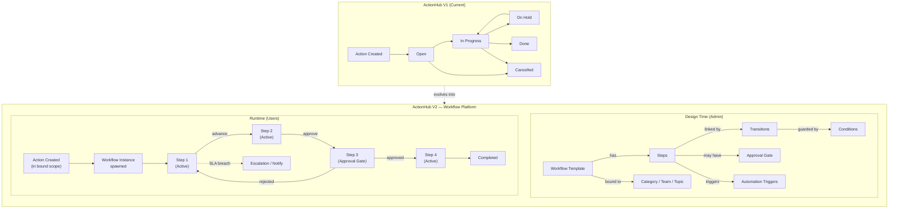
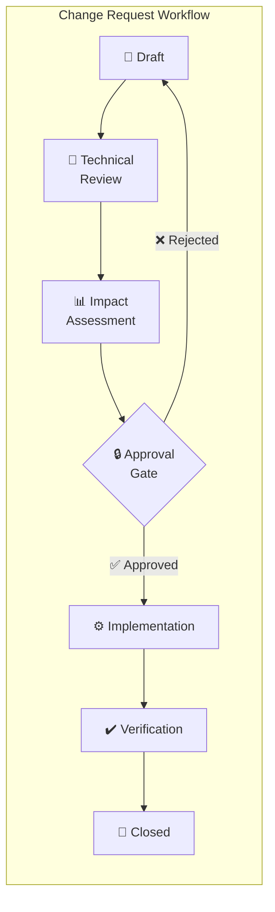
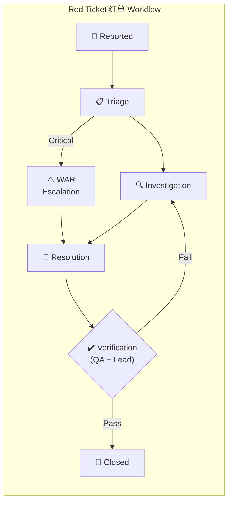
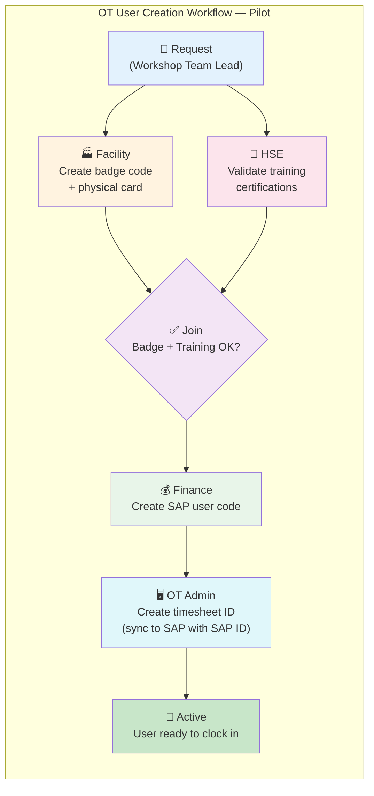

# ActionHub — Workflow App Extension (V2)

> **Status**: ✅ Current with historical notes retained for design history  
> **Depends on**: `R02_action_lifecycle.md`, `R03_assignment_workflow.md`  
> **Supersedes / Extends**: `R10_workflow_engine.md` (archived — promoted from “vision” to active requirement)  
> **Created**: 2026-03-08  
> **Revised**: 2026-03-19 — Current runtime decouples request workflows from mandatory supporting action persistence (WF-26)

> **Runtime supersession note (2026-03-19)**:
> - Request workflows may instantiate without a supporting `t_action` row; `wfi_action_id` is therefore optional at runtime.
> - The workflow dashboard and dedicated workbench routes are the primary runtime surfaces.
> - Existing-action workflow start remains compatibility-only and must not be treated as the default user flow.

---

## §1 Executive Summary

This requirement extends ActionHub from a centralized **action tracker** into a configurable **workflow application platform**. The goal is to enable organization teams to model, execute, and monitor structured multi-step **process workflows** (e.g., OT user creation, equipment requests, ECO) within the same tool they already use daily, while keeping actions and workflows as distinct work object types.

The extension retains ActionHub's core strength (simplicity, zero-training UX, bilingual support) while adding:

- **Workflow engine** — configurable multi-step processes with routing, approvals, SLAs, and automation triggers
- **Workflow runtime model** — process workflows are launched separately from actions; shared dashboard visibility does not imply a unified business object model
- **Graph-as-JSON templates** — workflow graph (steps, transitions, triggers, fields) stored as a single JSON column in `t_workflow_template` (O3 — reduces design-time tables from 8 → 1)
- **Step-level custom forms** — simple field types (text, dropdown, date, number, checkbox), checklists, and controlled step attachments with allowlist + audit trail
- **Parallel paths** — common pattern in multi-team processes where multiple teams work simultaneously before a join point
- **Hardcoded pilot first** — OT User Creation workflow implemented as Python dict before generalizing to JSON graph (O5)
- **Visual workflow builder** — React Flow builder in the SPA for template authoring, validation, and editing

### Key Design Decisions (from stakeholder refinement + optimization)

| # | Decision | Resolution |
|---|----------|------------|
| D-W1 | Workflow scope | Supports standalone process workflows as the primary model; action-linked workflow remains compatibility only |
| D-W2 | Step work payload | Simple types (text, dropdown, date, number, checkbox) + checklists + controlled attachments; CAD/executables remain blocked |
| D-W3 | Builder permissions | Current SPA exposes workflow builder navigation to **Admin** users; broader process-owner access remains a future UX decision |
| D-W5 | Notifications | **In-app** for V2; email integration in V2.5 |
| D-W6 | Parallel paths | Fully supported — common in real processes (e.g., OT user creation) |
| D-W7 | Status display | Workflow step name **replaces** the generic status (shows "HSE Validation" not "In Progress"); `act_status` stays canonical, computed `display_status` shows step name |
| D-W8 | Dashboard metrics | **Completion rate + lead time** are primary; every step has an SLA |
| D-W9 | Pilot workflow | **OT User Creation** (5 teams, parallel path) — see §4.4 |
| D-W10 | Builder UX | **Visual canvas** with React Flow in the SPA; graph editing remains API-first |
| D-W11 | Owner assignment timing | Owner can be selected at **workflow request creation** and workflow-step responsibility can change later through workflow runtime controls |

### Current runtime note

- Historical O2 notes below describe an earlier design direction where standalone requests were always persisted through `t_action`.
- The live runtime now allows request workflows to exist without a supporting action row.
- Action-linked workflow instances remain supported for compatibility, reporting, and older records.
| O1 | Phasing | Engine-first, canvas-later; hardcode pilot → generalize → builder |
| O2 | Runtime storage simplification | Current implementation may store workflow requests via `t_action`, but this must not be treated as the primary business model in UX or requirement language |
| O3 | Graph-as-JSON | Template graph stored as JSON in `wft_graph`; runtime tables stay normalized |
| O4 | Canvas technology | React Flow (`@xyflow/react`) in the React SPA |
| O5 | Hardcode pilot | OT workflow as Python dict first; extract to JSON graph in V2.1 |

---

## §1.1 Workflow Architecture — Visual Overview

> How ActionHub evolves from a flat action tracker (V1) to a configurable workflow platform (V2).



### Example Workflow: Change Request



### Example Workflow: Red Ticket (红单)



### Pilot Workflow: OT User Creation (D-W9)

This is the first workflow to be implemented — a standalone process request (not an action item) that crosses 5 teams with a parallel path:



| Step | Team | SLA | Form Fields | Notes |
|------|------|-----|-------------|-------|
| **Request** | Workshop Team Lead | — | Employee name, role, start date, workshop zone | Trigger: parallel dispatch to Facility + HSE |
| **Facility** | Facility | 24h | Badge code (output), card printed (checkbox) | Parallel with HSE |
| **HSE Validation** | HSE | 48h | Training record checklist (safety induction, equipment-specific, PPE) | Parallel with Facility |
| **Join** | — | — | — | Auto-advances when both Facility + HSE are complete |
| **Finance** | Finance | 24h | SAP user code (output) | Sequential after join |
| **OT Admin** | OT Admin | 24h | Timesheet ID (output), SAP ID reference (input from Finance step) | Sync to SAP |
| **Active** | — | — | — | End state: user is operational |

---

## §2 Problem Statement

### §2.1 Current Limitations

ActionHub V1 treats every item as a flat action with a linear lifecycle (`Open → In Progress → On Hold → Done / Cancelled`). This model works for ad-hoc tasks but fails for:

| Gap | Example |
|-----|---------|
| **Multi-step processes** | A change request that must pass through technical review → impact assessment → approval → implementation → verification |
| **Approval gates** | Quality deviations that require sign-off from QA lead before closure |
| **Conditional routing** | Critical priority items that skip normal review and go straight to escalation |
| **Cross-team handoffs** | An item that starts with Engineering, moves to Procurement, then to Quality — each team "owns" their step |
| **Process compliance** | No enforcement that step X was completed before step Y; managers rely on manual checking |
| **SLA enforcement** | No automated escalation when a step sits idle beyond its time limit |
| **Parallel tracks** | A project action that needs both supplier qualification AND design validation to proceed |

### §2.2 Strategic Value

Extending ActionHub into a workflow platform:
- **Eliminates shadow processes** — teams currently run parallel Excel/email workflows outside ActionHub
- **Makes process visible** — management sees where items are stuck, not just whether they're "Open" or "Done"
- **Enforces standards** — quality, change management, and escalation processes follow defined paths
- **Reduces follow-up overhead** — automatic routing, reminders, and escalation replace manual chasing
- **Leverages existing adoption** — users already know ActionHub; adding workflow is an upgrade, not a migration

---

## §3 Scope

### §3.1 In Scope

| Capability | Description |
|------------|-------------|
| **Workflow Templates** | Admin-configurable process definitions stored as JSON graph in `t_workflow_template` (O3) |
| **Step Execution** | Users advance items through workflow steps, each with its own assignee, required fields, and SLA |
| **Approval Gates** | Configurable approval checkpoints (single, any-of-N, all-of-N) |
| **Conditional Routing** | Branch workflow path based on field values (e.g., priority, category) — V2.5 |
| **Parallel Steps** | Two or more steps that can execute concurrently with a join point |
| **Automation Triggers** | On step enter / exit / SLA breach: send notifications and set fields |
| **Visual Status** | Step-progress indicator on workflow-oriented runtime views; action detail display is compatibility-only when a linked workflow exists |
| **Workflow Dashboard** | Overview of all in-flight workflow instances by template, step, SLA status; actions and workflow work appear on the same dashboard in separate panels — V2.2 |
| **Backward Compatibility** | Existing-action workflow linkage may remain for compatibility, but is not the primary operating model |
| **Workflow Binding** | Template bindings are selection aids and governance metadata; they do not imply automatic workflow start on action creation |
| **Runtime Separation** | Workflow requests may currently reuse existing persistence structures, but workflows remain a separate work domain from actions in the product model |
| **Owner at Intake** | Workflow request form accepts optional `owner_user_id`; defaults to creator when omitted |
| **Step Custom Forms** | Simple field types (text, dropdown, date, number, checkbox) + checklists per step (D-W2) |
| **Workflow Workbench** | Single runtime workspace for step assignment, status, form data, attachments, and timeline |
| **Step Attachments** | Controlled file uploads tied to a workflow step instance with audit, notifications, and file-type restrictions |
| **Builder Permissions** | Current SPA navigation exposes workflow template authoring to Admin users only; broader process-owner access remains future scope (D-W3) |
| **Builder Authoring** | In-app workflow template authoring and editing only; no file import/export |
| **Visual Canvas** | React Flow-based drag-and-drop builder in the SPA — V2.4 (O4) |
| **Hardcoded Pilot** | OT User Creation as Python dict → JSON graph (O5) |

### §3.2 Out of Scope (V2)

| Not Included | Rationale |
|-------------|-----------|
| Unrestricted step attachments | Only controlled allowlist uploads are in scope; CAD, archives, executables, and unrestricted image repositories remain out of scope |
| AI agent integration | Covered by R11 (V3+ scope) |
| External system triggers (SAP, email) | V3 when API layer is mature |
| Email notifications | V2 is in-app only; email in V2.x (D-W5) |
| Mobile-optimized workflow forms | Current UX philosophy is desktop browser |

---

## §4 Workflow Model

### §4.1 Core Concepts

| Concept | Definition |
|---------|------------|
| **Workflow Template** | A named, versioned process definition containing a JSON graph of steps, transitions, triggers, and form fields (O3) |
| **Step** | A discrete stage in a workflow — has a name, responsible role/user, required fields, SLA duration, and optional approval gate. Defined in `wft_graph` JSON. |
| **Transition** | A directed link between two steps, optionally guarded by a condition. Defined in `wft_graph` JSON. |
| **Gate** | An approval checkpoint attached to a step that must be satisfied before the transition fires |
| **Trigger** | An automated side-effect that fires on step entry, step exit, or SLA breach. Defined in `wft_graph` JSON. |
| **Workflow Instance** | A running copy of a workflow template representing a process work item; an action link may exist in implementation but is not the primary business concept |
| **Workflow Request** | A standalone process workflow instance started from workflow-specific UI and handled through workflow runtime surfaces |
| **Current Step** | The active step(s) in a workflow instance |

### §4.2 Workflow Lifecycle

```
Template (design-time) — stored as JSON graph in wft_graph (O3)
   │
  ├── Instantiate (when a user starts a process workflow from the workflow area)
   │       │
   │       ▼
  │   Instance (runtime) — process workflow work item
   │       │
   │       ├── Step 1 [Active] → Step 2 [Active] → ... → Final Step → Completed
   │       │                          │
   │       │                          └── (rejected) → loop back to Step N
   │       │
   │       └── Cancelled / Suspended
   │
   └── New Version (does not affect in-flight instances)
```

### §4.3 Initial Workflow Templates

Based on current organization processes:

| Template | Steps | Primary User |
|----------|-------|-------------|
| **Simple Action** (default) | Open → In Progress → Done | All teams |
| **OT User Creation** (pilot) | Request → Facility + HSE (parallel) → Join → Finance → OT Admin → Active | Workshop, Facility, HSE, Finance, OT |
| **Change Request** | Draft → Technical Review → Impact Assessment → Approval → Implementation → Verification → Closed | Engineering, CI |
| **Red Ticket (红单)** | Reported → Triage → Investigation → Resolution → Verification → Closed | Quality, Production |
| **Supplier Issue** | Detected → Supplier Notification → Root Cause → Corrective Action → Validation → Closed | Sourcing, Quality |
| **Meeting Action** | Captured → Assigned → In Progress → Review → Closed | Cross-team |

---

## §5 Data Model (Optimized — O2 + O3)

> **Table reduction**: 11 tables → 5 tables. Design-time data (steps, transitions, triggers, fields) lives in a single JSON column `wft_graph`. Runtime tables stay normalized for querying.

### §5.1 Architecture: Design-Time vs Runtime

| Layer | Storage | Tables | Rationale |
|-------|---------|--------|-----------|
| **Design-time** | JSON graph in `wft_graph` | 1 (`t_workflow_template`) | Steps, transitions, triggers, fields change together; JSON avoids 7-JOIN reads; version = new row |
| **Runtime** | Normalized relational | 4 (`t_workflow_instance`, `t_workflow_step_instance`, `t_workflow_step_field_value`, `t_workflow_approval`) | Must query "all items at step X", "SLA breaches", "approvals pending" efficiently |

### §5.2 New Tables (5 total)

```sql
-- ─────────────────────────────────────────────────
-- DESIGN-TIME: 1 table with JSON graph
-- ─────────────────────────────────────────────────

-- Workflow template definition (O3: graph-as-JSON)
CREATE TABLE t_workflow_template (
    wft_id          INTEGER PRIMARY KEY AUTOINCREMENT,
    wft_name_en     TEXT NOT NULL,
    wft_name_cn     TEXT,
    wft_desc        TEXT,
    wft_version     INTEGER NOT NULL DEFAULT 1,
    wft_is_default  INTEGER NOT NULL DEFAULT 0,  -- "Simple Action" default template
    wft_type        TEXT NOT NULL DEFAULT 'action'
        CHECK (wft_type IN ('action', 'request')),  -- D-W1: action-bound or standalone request (O2)
    wft_active      INTEGER NOT NULL DEFAULT 1,
    wft_graph       TEXT NOT NULL DEFAULT '{}',   -- O3: JSON graph (see §5.3 for schema)
    wft_created_by  INTEGER NOT NULL,
    wft_created_at  TEXT NOT NULL DEFAULT CURRENT_TIMESTAMP,
    wft_updated_at  TEXT,
    FOREIGN KEY (wft_created_by) REFERENCES t_user(usr_id)
);

-- ─────────────────────────────────────────────────
-- RUNTIME: 4 normalized tables
-- ─────────────────────────────────────────────────

-- Running workflow instances (primary runtime object; supporting action optional)
CREATE TABLE t_workflow_instance (
    wfi_id          INTEGER PRIMARY KEY AUTOINCREMENT,
    wfi_template_id INTEGER NOT NULL,
  wfi_action_id   INTEGER UNIQUE,              -- optional supporting action for compatibility flows
    wfi_status      TEXT NOT NULL DEFAULT 'Active'
        CHECK (wfi_status IN ('Active', 'Completed', 'Cancelled', 'Suspended')),
    wfi_started_at  TEXT NOT NULL DEFAULT CURRENT_TIMESTAMP,
    wfi_completed_at TEXT,
    FOREIGN KEY (wfi_template_id) REFERENCES t_workflow_template(wft_id),
    FOREIGN KEY (wfi_action_id) REFERENCES t_action(act_id) ON DELETE CASCADE
);

-- Current position(s) in a workflow instance
CREATE TABLE t_workflow_step_instance (
    wsi_id          INTEGER PRIMARY KEY AUTOINCREMENT,
    wsi_instance_id INTEGER NOT NULL,
    wsi_step_key    TEXT NOT NULL,               -- key into wft_graph.steps (e.g., "hse_validation")
    wsi_status      TEXT NOT NULL DEFAULT 'Pending'
        CHECK (wsi_status IN ('Pending', 'Active', 'Completed', 'Skipped', 'Rejected')),
    wsi_assignee_id INTEGER,
    wsi_entered_at  TEXT,
    wsi_completed_at TEXT,
    wsi_sla_deadline TEXT,
    wsi_comment     TEXT,
    FOREIGN KEY (wsi_instance_id) REFERENCES t_workflow_instance(wfi_id) ON DELETE CASCADE,
    FOREIGN KEY (wsi_assignee_id) REFERENCES t_user(usr_id)
);

-- Values filled in per step instance (runtime form data)
CREATE TABLE t_workflow_step_field_value (
    sfv_id          INTEGER PRIMARY KEY AUTOINCREMENT,
    sfv_step_inst_id INTEGER NOT NULL,
    sfv_field_key   TEXT NOT NULL,               -- key into wft_graph.steps[].fields (e.g., "badge_code")
    sfv_value       TEXT,                        -- stored as text; JSON for checklist
    sfv_filled_by   INTEGER,
    sfv_filled_at   TEXT NOT NULL DEFAULT CURRENT_TIMESTAMP,
    FOREIGN KEY (sfv_step_inst_id) REFERENCES t_workflow_step_instance(wsi_id) ON DELETE CASCADE,
    FOREIGN KEY (sfv_filled_by) REFERENCES t_user(usr_id)
);

-- Approval records for gate steps
CREATE TABLE t_workflow_approval (
    wap_id          INTEGER PRIMARY KEY AUTOINCREMENT,
    wap_step_inst_id INTEGER NOT NULL,
    wap_approver_id INTEGER NOT NULL,
    wap_decision    TEXT NOT NULL CHECK (wap_decision IN ('Approved', 'Rejected', 'Abstained')),
    wap_comment     TEXT,
    wap_decided_at  TEXT NOT NULL DEFAULT CURRENT_TIMESTAMP,
    FOREIGN KEY (wap_step_inst_id) REFERENCES t_workflow_step_instance(wsi_id) ON DELETE CASCADE,
    FOREIGN KEY (wap_approver_id) REFERENCES t_user(usr_id)
);

```

### §5.3 JSON Graph Schema (wft_graph)

The `wft_graph` column stores the full workflow definition as JSON. This replaces what would have been 7 separate tables (steps, transitions, triggers, fields, bindings, etc.).

```json
{
  "steps": {
    "request": {
      "name_en": "Request",
      "name_cn": "申请",
      "type": "Task",
      "order": 1,
      "role": "TeamLead",
      "sla_hours": null,
      "fields": [
        { "key": "employee_name", "label_en": "Employee Name", "label_cn": "员工姓名", "type": "text", "required": true },
        { "key": "role", "label_en": "Role", "label_cn": "角色", "type": "dropdown", "options": ["Operator", "Technician", "Engineer"], "required": true },
        { "key": "start_date", "label_en": "Start Date", "label_cn": "入职日期", "type": "date", "required": true },
        { "key": "workshop_zone", "label_en": "Zone", "label_cn": "车间区域", "type": "dropdown", "options": ["Zone A", "Zone B", "Zone C"] }
      ],
      "triggers": []
    },
    "facility": {
      "name_en": "Facility",
      "name_cn": "设施",
      "type": "Task",
      "order": 2,
      "role": "Facility",
      "sla_hours": 24,
      "fields": [
        { "key": "badge_code", "label_en": "Badge Code", "label_cn": "工牌编号", "type": "text", "required": true },
        { "key": "card_printed", "label_en": "Card Printed", "label_cn": "卡片已打印", "type": "checkbox" }
      ],
      "triggers": []
    },
    "hse_validation": {
      "name_en": "HSE Validation",
      "name_cn": "HSE验证",
      "type": "Task",
      "order": 2,
      "role": "HSE",
      "sla_hours": 48,
      "fields": [
        { "key": "training_checklist", "label_en": "Training Checklist", "label_cn": "培训清单", "type": "checklist", "options": ["Safety induction", "Equipment-specific", "PPE training", "Emergency procedures"], "required": true }
      ],
      "triggers": []
    },
    "join": { "name_en": "Join", "name_cn": "合并", "type": "Join", "order": 3 },
    "finance": {
      "name_en": "Finance",
      "name_cn": "财务",
      "type": "Task",
      "order": 4,
      "role": "Finance",
      "sla_hours": 24,
      "fields": [
        { "key": "sap_user_code", "label_en": "SAP User Code", "label_cn": "SAP用户代码", "type": "text", "required": true }
      ],
      "triggers": []
    },
    "ot_admin": {
      "name_en": "OT Admin",
      "name_cn": "OT管理员",
      "type": "Task",
      "order": 5,
      "role": "OT",
      "sla_hours": 24,
      "fields": [
        { "key": "timesheet_id", "label_en": "Timesheet ID", "label_cn": "考勤ID", "type": "text", "required": true },
        { "key": "sap_id_ref", "label_en": "SAP ID Reference", "label_cn": "SAP ID参考", "type": "text", "required": true }
      ],
      "triggers": []
    },
    "active": { "name_en": "Active", "name_cn": "激活", "type": "End", "order": 6 }
  },
  "transitions": [
    { "from": "request", "to": "facility", "label_en": "Dispatch", "label_cn": "派发" },
    { "from": "request", "to": "hse_validation", "label_en": "Dispatch", "label_cn": "派发" },
    { "from": "facility", "to": "join", "label_en": "Done", "label_cn": "完成" },
    { "from": "hse_validation", "to": "join", "label_en": "Validated", "label_cn": "已验证" },
    { "from": "join", "to": "finance", "label_en": "Auto", "label_cn": "自动" },
    { "from": "finance", "to": "ot_admin", "label_en": "SAP code ready", "label_cn": "SAP代码就绪" },
    { "from": "ot_admin", "to": "active", "label_en": "Complete", "label_cn": "完成" }
  ],
  "bindings": [
    { "scope_type": "team", "scope_id": null }
  ]
}
```

### §5.4 Changes to Existing Tables

| Table | Change | Reason |
|-------|--------|--------|
| `t_action` | Add `act_source` value `'WorkflowRequest'` to CHECK constraint | O2: standalone workflow requests are actions |
| `t_action` | `act_status` stays canonical; add computed `display_status` property | D-W7: shows workflow step name when applicable |
| `t_action_history` | Add `'WorkflowAdvance'` and `'ApprovalDecision'` to `ahi_change_type` CHECK | Audit trail for workflow events |

### §5.5 Table Summary (Before → After)

| Before (11 tables) | After (5 tables) | Change |
|---------------------|-------------------|--------|
| `t_workflow_template` | `t_workflow_template` (with `wft_graph`) | Absorbed steps, transitions, triggers, fields, bindings into JSON |
| `t_workflow_step` | — | Moved to `wft_graph.steps` |
| `t_workflow_transition` | — | Moved to `wft_graph.transitions` |
| `t_workflow_trigger` | — | Moved to `wft_graph.steps[].triggers` |
| `t_workflow_step_field` | — | Moved to `wft_graph.steps[].fields` |
| `t_workflow_binding` | — | Moved to `wft_graph.bindings` |
| `t_process_request` | — | Merged into `t_action` with `act_source='WorkflowRequest'` (O2) |
| `t_workflow_instance` | `t_workflow_instance` | Simplified: `wfi_action_id` optional, unique when present |
| `t_workflow_step_instance` | `t_workflow_step_instance` | `wsi_step_key` replaces FK to removed `t_workflow_step` |
| `t_workflow_step_field_value` | `t_workflow_step_field_value` | `sfv_field_key` replaces FK to removed `t_workflow_step_field` |
| `t_workflow_approval` | `t_workflow_approval` | Unchanged |

---

## §6 User Experience

### §6.1 Action Detail — Workflow Progress Bar

When an action is bound to a workflow, the detail page shows a horizontal step-progress indicator:

```
  ● Draft  →  ◉ Tech Review  →  ○ Approval  →  ○ Implementation  →  ○ Done
                 (current)
```
- Completed steps: filled circle (●)
- Current step: highlighted ring (◉) with assignee name and SLA countdown
- Future steps: empty circle (○)

### §6.2 Step Transition UX

Replacing the simple status dropdown, workflow-bound actions show **transition buttons** based on available transitions from the current step:

```
  [ ✓ Approve & Advance ]   [ ✗ Reject → Back to Draft ]   [ ⏸ Suspend ]
```

Each button may require a comment or specific field to be filled (per step configuration).

### §6.3 Workflow Dashboard (D-W8)

A new top-level dashboard tab showing:
- **Completion Rate**: percentage of workflow instances completed vs. total started, by template
- **Lead Time**: average end-to-end duration per workflow template (request → completion)
- **Step Lead Time**: average time spent in each step vs. its SLA — highlights the slowest steps
- **SLA Compliance**: percentage of step instances completed within SLA, by step and by team
- **Bottleneck View**: steps with the most items currently waiting (highlights process bottlenecks)
- **My Approvals**: pending approval gates assigned to the current user
- **Active Instances**: count of in-flight instances per workflow template, filterable by team

### §6.4 Workflow Builder (Phased: O1 + O4)

The Workflow Builder evolves across three phases:

#### Phase 1 — Hardcoded Pilot (V2.0-alpha) — O5

No builder UI. OT User Creation workflow defined as a Python dict in code:

```python
OT_USER_CREATION = {
    "steps": { ... },       # See §5.3 JSON schema
    "transitions": [ ... ],
}
```

Admin "activates" the pilot workflow from a simple settings toggle. This validates the engine before any builder investment.

#### Phase 2 — In-App Template Editing (V2.3)

Admin users create and revise workflow templates directly in ActionHub. Templates are persisted as validated `wft_graph` JSON in `t_workflow_template`; file-based import/export is explicitly out of scope.

#### Phase 3 — Visual Canvas with React Flow (V2.4) — O4

A **visual drag-and-drop canvas** using React Flow in the React SPA. The builder now runs as an authenticated SPA screen and persists validated graph edits through ActionHub workflow APIs.

**Technology choice rationale (O4)**:
- Zero build toolchain — fits Flask + Jinja2 + HTMX stack
- 4 KB gzipped — no bundle size concern
- Vanilla JS — no framework dependency
- MIT license — no commercial restrictions
- Supports node-based editing with input/output ports
- Persists graph edits directly to `wft_graph` through ActionHub APIs

---

## §7 Migration & Compatibility

### §7.1 Backward Compatibility

- All existing actions remain on the implicit "Simple" workflow (`Open → In Progress → On Hold → Done / Cancelled`)
- The Simple workflow is the default; actions only follow a custom workflow when their category/team/topic is bound to one
- Users who never interact with workflow-bound categories see no change in their experience

### §7.2 Data Migration

- Create the `t_workflow_*` tables
- Seed the "Simple Action" default workflow template
- Existing `t_action.act_status` values map to Simple workflow steps
- No existing data is modified; workflow instances are created only for new actions going forward

---

## §8 Phased Delivery (Revised — O1)

> **Strategy**: Engine-first, canvas-later. Validate with real users on hardcoded pilot before investing in builder UI.

| Phase | Scope | Tables Created |
|-------|-------|----------------|
| **V2.0-alpha** | 6 workflow tables + **hardcoded OT User Creation pilot** (Python dict — O5) + early action-detail progress UI used during initial rollout; later runtime UX moved to workflow dashboard/workbench | All 6 |
| **V2.0-beta** | SLA monitoring (APScheduler) + in-app notifications for SLA breach + step form field values (runtime data) | — |
| **V2.1** | Approval gates + Red Ticket workflow (second template) + extract pilot to JSON graph | — |
| **V2.2** | Workflow dashboard (completion rate, lead time, SLA compliance, bottleneck view) | — |
| **V2.3** | In-app template editor + additional templates (Change Request, Supplier Issue) | — |
| **V2.4** | Visual canvas builder with React Flow (O4) + Auto-layout + Live validation | — |
| **V2.5** | Conditional routing + email notifications for workflow events + TeamLead self-service | — |

---

## §9 Open Questions

*See §10 — Refinement questions to be resolved with stakeholders.*

---

## §10 Resolved Decisions & Next Round of Questions

### §10.1 Resolved Decisions (Round 1 + Optimizations)

| # | Question | Answer | Impact on Spec |
|---|----------|--------|----------------|
| Q1 | Workflow scope beyond actions? | **Yes** — support standalone requests | Standalone request workflows may run without a bound action; action linkage remains optional/compatibility-oriented |
| Q2 | Step work payload? | Simple types + checklists + controlled attachments | Fields defined in `wft_graph.steps[].fields`; files stored as step attachments with policy checks |
| Q3 | Who can build? | **Admin in the current SPA** | Broader process-owner access remains a future UX decision |
| Q5 | Notification channels? | **In-app only** for V2; email in V2.5 | No email infra needed for V2.0–V2.4 |
| Q6 | Parallel paths? | **Quite common** | Parallel/Join step types are core, not advanced |
| Q7 | Status display? | Step name **replaces** generic status | `act_status` stays canonical; computed `display_status` shows step name |
| Q8 | Dashboard metrics? | **Completion rate + lead time**; every step has SLA | Dashboard redesigned around lead time and SLA compliance |
| Q9 | Pilot workflow? | **OT User Creation** (5 teams, parallel) | Hardcoded as Python dict in V2.0-alpha (O5) |
| Q10 | Builder UX? | **Visual canvas** (drag-and-drop) | Delivered with React Flow in V2.4; in-app editing only |
| O1 | Phasing? | Engine-first, canvas-later | Revised: V2.0-alpha → V2.5 (see §8) |
| O2 | Separate entity for requests? | **No** — keep requests in workflow runtime first | Supporting action creation is optional; workflow dashboard/workbench remain the primary request surface |
| O3 | Normalized vs JSON graph? | **JSON** for design-time, normalized for runtime | 12 tables → 6; `wft_graph` column stores full template |
| O4 | Canvas technology? | **React Flow** | Integrated into the React SPA builder route |
| O5 | Start with builder? | **No** — hardcode pilot first | Python dict → JSON graph → in-app editor → canvas |

### §10.2 Refinement Questions — Round 2

> The following questions dig deeper into the decisions above to resolve implementation details.

**Q11 — OT User Creation: who triggers the request?**  
You said "workshop team leaders" initiate it. Is this always a specific TeamLead, or can any member of the Workshop team submit a request? Does the requester need to fill in the new employee's details (name, role, zone), or does someone else provide that information?

**Q12 — Step-to-step data passing**  
In the OT User Creation workflow, Finance creates a SAP code at step 5, and OT Admin needs that code at step 6. Should form field values from earlier steps be **visible (read-only)** to later steps automatically, or must the user manually copy-paste? This "data flow between steps" pattern likely applies to other workflows too.

**Q13 — Process request list & search**  
Standalone process requests (like OT User Creation) won't appear in the main action list. Where should they live in the UI? Options: (a) a new "Requests" tab at the top level, (b) mixed into the action list with a type filter, (c) accessible only from a workflow-specific view. Which feels right for your users?

**Q14 — Parallel step assignment**  
When "Request" dispatches to Facility + HSE simultaneously, who gets assigned to each parallel step? Options: (a) pre-configured in the template (e.g., always goes to "Facility Lead" role), (b) the requester picks both assignees at submission time, (c) each team lead picks up the task from a queue. Which fits your current culture?

**Q15 — SLA calendar**  
You want every step to have an SLA in hours. Should SLA hours count only **business hours** (Mon–Fri, 8–17 local time), or **calendar hours** (24/7)? If business hours, do Chinese public holidays count as non-working days? This matters a lot for a 24h SLA.

**Q16 — What happens when a step is rejected?**  
In an approval gate (e.g., HSE fails training validation), does the workflow: (a) go all the way back to the start (requester must re-submit), (b) go back one step only, (c) the approver chooses which step to send it back to, or (d) the request gets cancelled? Different workflows might need different rejection behaviors.

**Q17 — Canvas builder: technology preference?**  
For the visual workflow canvas, your dev team will need a JavaScript diagramming library. Options: (a) [React Flow](https://reactflow.dev/) — modern React-based node editor, (b) [jsPlumb](https://jsplumbtoolkit.com/) — lightweight vanilla JS, (c) [GoJS](https://gojs.net/) — commercial, very polished, (d) lightweight custom SVG/Canvas. Since ActionHub is Flask + Jinja2 (server-rendered), do you prefer a standalone JS library that integrates as a widget, or are you considering moving some UI to a framework like Vue/React?

**Q18 — Versioning behavior for in-flight instances**  
When an admin edits a workflow template and saves a new version, existing running instances stay on the old version. But should the admin have the option to **migrate** in-flight instances to the new version (e.g., if a step was renamed)? Or is "old instances stay, new instances use new version" always the rule?

**Q19 — Checklist completion enforcement**  
In the HSE Validation step, the checklist has items like "Safety induction", "PPE training", etc. Must **all checklist items** be checked before the step can be advanced, or can some be marked as optional/N/A? Can the checklist items vary by context (e.g., different training requirements for different workshop zones)?

**Q20 — Reporting: lead time breakdown**  
You want lead time as a primary metric. Should the dashboard show: (a) only the total end-to-end lead time per workflow, (b) also a breakdown by step (Sankey or waterfall chart showing where time is spent), (c) trend over time (are we getting faster month over month)? What visualization would make you take action?
